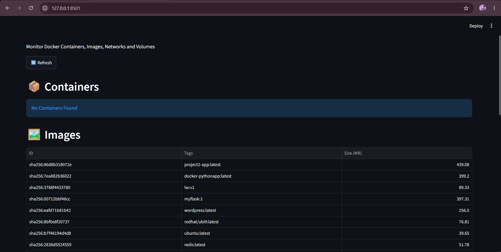
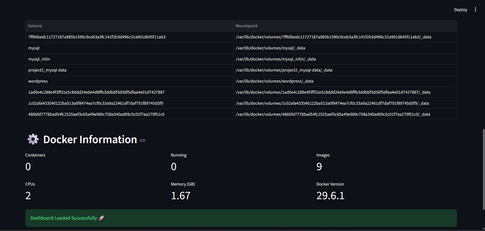

# Docker Dashboard Project

This repository contains a Python and Streamlit based web dashboard that automatically monitors and displays your local Docker environment, including containers, images, networks, and system information.

### Dashboard Graphical View:

